# Navigation

Cheat Sheet

Function | PC Keyboard | Mac Keyboard
-------- | ----------- | ------------
Move cells | Arrow keys | Arrow keys
Contiguous movement between cells | Ctrl + Arrow | Cmd + Arrow
Selecting cells | Shift + Arrow | Shift + Arrow
Selecting contiguous cells | Ctrl + Shift + Arrow | Cmd + Shift + Arrow
Selecting row | Shift + Spacebar | Shift + Spacebar
Selecting column | Ctrl + Spacebar | Cmd + Spacebar
Selecting entire worksheet | Ctrl + Shift + A | Cmd + Shift + A
Adding a row, column, or range of cells | Ctrl + "+" | Cmd + "+"
Deleting a row, column, or range of cells | Ctrl + "-" | Cmd + "-"
Resizing a selected row, column, or range | Alt + h + o + i (pressed in sequence) | Option + h + o + i (pressed in sequence)
Hiding a selected row or rows of cells | Ctrl + 9 | Cmd + 9
Revealing hidden rows | Ctrl + Shift + ( | Cmd + Shift + (
Hiding a selected column or column of cells | Ctrl + 0 | Cmd + 0
Revealing hidden columns | Ctrl + Shift +) | Cmd + Shift + )

## Movement and Selection

### Simple Movement

These hotkeys will allow you to navigate between cells and sheets in your workbook efficiently and with less effort than is required when using the mouse to interact with Excel's graphical user interface. To most casual users of Excel these shortcuts and hotkey combinations will seem like a trivial detail. However, to those of us who use Excel for extended periods of time while working on tasks such as data manipulation and data mining becoming comfortable with these shortcuts and key combinations are crucial to using Excel effeciently and with less frustration and mistakes. The following outline covers a small portion of the most commonly used hotkey combinations with small examples of their use in action. It starts from the simplest movement (navigating between cells), and builds on combining these hotkeys in ways that can accomplish more complex tasks - all without the use of a mouse.

### Simple keyboard movements

Keyboard Combination | Key | Movement
------------ | ------------- | -------------
**->** | Right Arrow | Move one cell to the Right
**<-** | Left Arrow | Move one cell to the left
**↑**   | Up Arrow | Move one cell up
**↓**   | Down Arrow | Move one cell down

PC Keyboards

Mac Keyboards
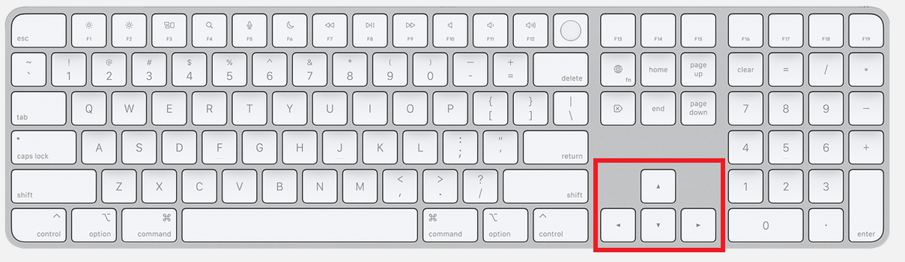

### Contiguous Movement Between Cells

Contiguous movement is the movement of your curser between contiguous groups of cells, such as to the end of a row or end of a column. It is useful when you need to quickly jump to the end of a column or row of a large worksheet without having to scroll all the way through several thousand rows or mouse over several dozen columns.  To select the end of a contiguous row or column of data simple use Shift + Arrow keys

Keyboard Combination | Key | Movement
------------ | ------------- | -------------
**->** | Ctrl + Right Arrow | Move to the right most contiguous cell in the row
**<-** | Ctrl + Left Arrow | Move to the left most contiguous cell in the row
**↑**   | Ctrl + Up Arrow | Move to the top most contiguous cell in a column
**↓**   | Ctrl + Down Arrow | Move to the bottom most contiguous cell in a column

PC Keyboards
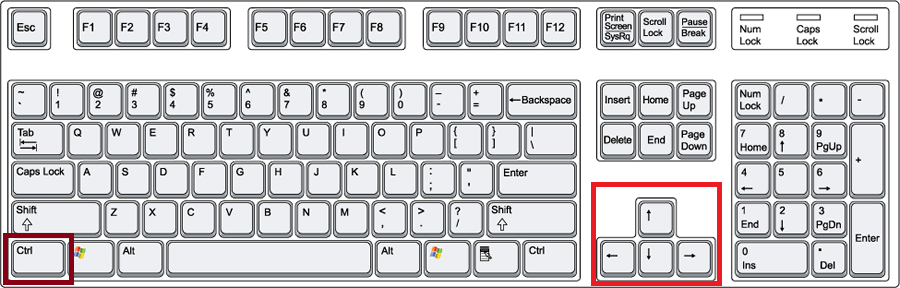

Mac Keyboards
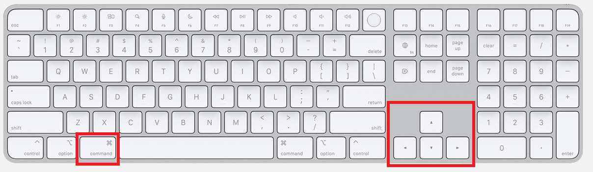

### Selecting Multiple Cells, Columns, or Rows

The combination of Shift + Arrow Key will allow you select multiple cells, columns, or rows.

Keyboard Combination | Key | Movement
------------ | ------------- | -------------
**->** | Shift + Right Arrow | Move to the right most contiguous cell in the row
**<-** | Shift + Left Arrow | Move to the left most contiguous cell in the row
**↑**   | Shift + Up Arrow | Move to the top most contiguous cell in a column
**↓**   | Shift + Down Arrow | Move to the bottom most contiguous cell in a column

PC Keyboards
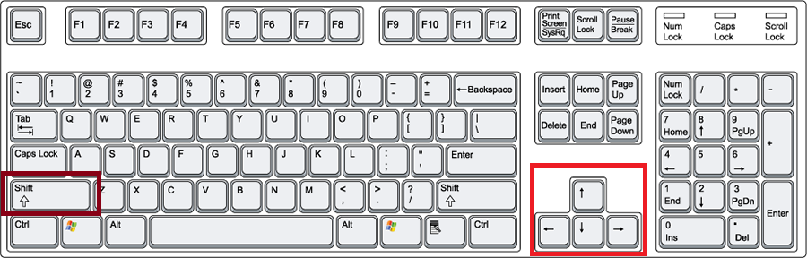

Mac Keyboards
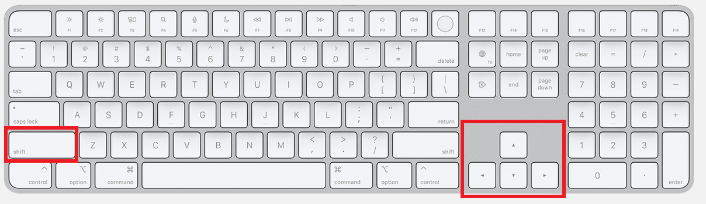

Selecting multiple cells, columns, or rows
[INSERT VIDEO HERE]

### Rapidly Selecting Contiguous Cells
It is often helpful to rapidly select a contiguous row or column of cells in order to modify, delete, or move the data in that row or column. To quickly highlight and select a contiguous row or column you would hold down Shift + Ctrl and the appropriate arrow key

Keyboard Combination | Key | Movement
------------ | ------------- | -------------
**->** | Shift + Ctrl + Right Arrow | Move to the right most contiguous cell in the row
**<-** | Shift + Ctrl + Left Arrow | Move to the left most contiguous cell in the row
**↑**   | Shift + Ctrl + Up Arrow | Move to the top most contiguous cell in a column
**↓**   | Shift + Ctrl + Down Arrow | Move to the bottom most contiguous cell in a column

PC Keyboards
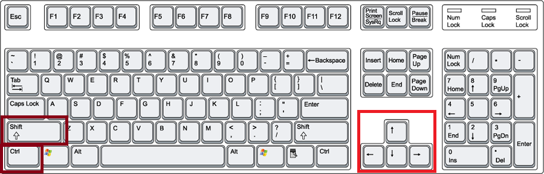

Mac Keyboards
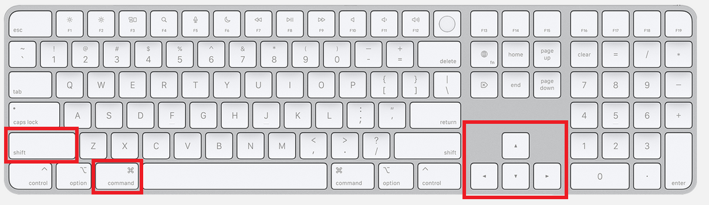

Rapidly selecting contiguous cells
[INSERT VIDEO HERE]

### Rapidly Selecting An Entire Row

Sometimes it may be more efficient to simply select and entire row or column on your worksheet containing data, without regard to where in that row the data begins or ends. To rapidly select an entire row in your worksheet use the hotkey combination of Shift + Spacebar. This is equivalent to selecting the row index by clicking on the desired row number on the far left of your worksheet.

PC Keyboards
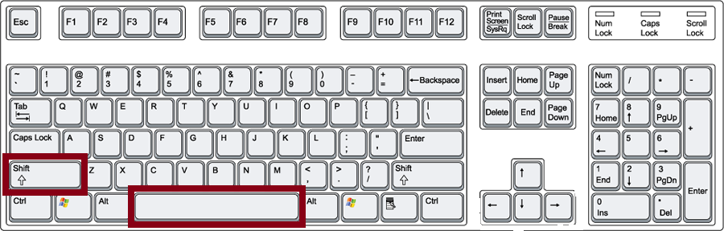

Mac Keyboards
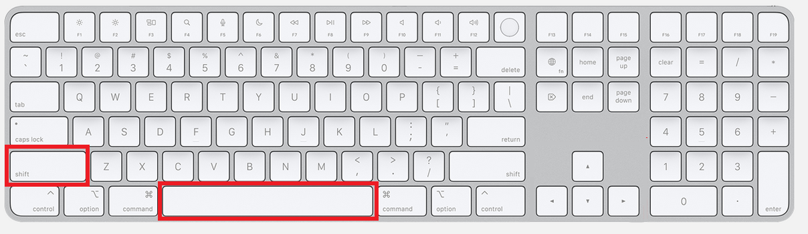

### Rapidly Selecting An Entire Column or Range

To rapidly select an entire column in your worksheet use the hotkey combination of Ctrl + Spacebar. Be careful that this hotkey selects an entire range of cells rather than just the individual column. Most of the time the "range" selected will only involve an individual column of cells. However, in certain cases this hotkey will select multiple contiguous columns within a given range. This is equivalent to selecting a column by clicking on the desired column letter at the top of your worksheet.

PC Keyboards
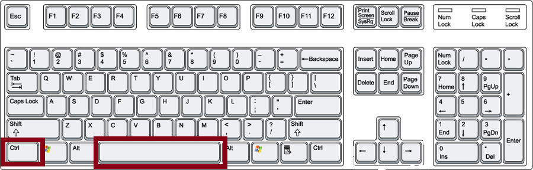

Mac Keyboards
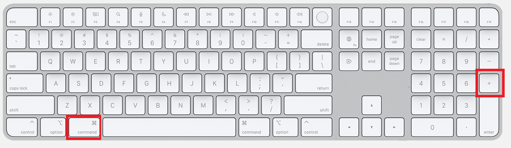

### Rapidly Selecting the Entire Worksheet
To rapidly select all of the cells in the current worksheet use Ctrl + Shift + A

PC Keyboards
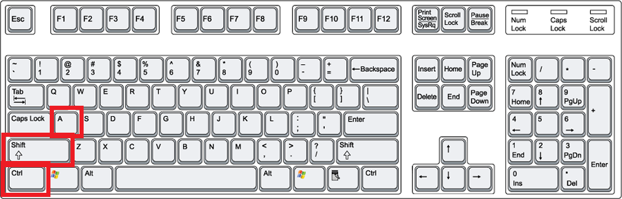

Mac Keyboards
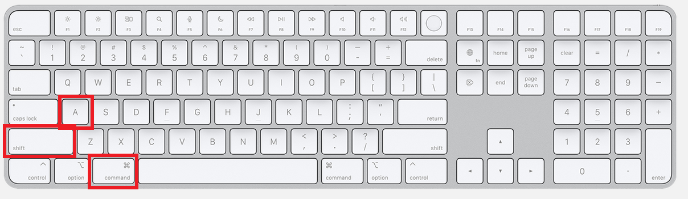

Rapidly selecting rows, columns, and worksheets
[INSERT VIDEO HERE]

## Adding and Deleting Rows and Columns

### Adding a Row or Column

To add a row or column of cells use your mouse or hotkey combination to select a row, column, or range of cells and use the hotkey combination of Ctrl and the "+" key. Your new row of cells will be added above or to the left of your selection.

PC Keyboards
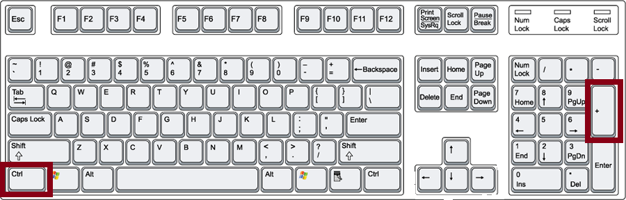

Mac keyboards

Rapidly adding a row or column
[INSERT VIDEO HERE]

### Deleting a Row or Column

To quickly delete an entire row from your worksheet use Ctrl and the "-" key. This combination may also be used when you have only selecte a range of cells, in which case you will be asked by Excel how to handle the remaining data after the removal of your selected range.

PC Keyboards
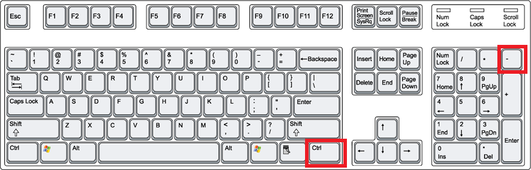

Mac keyboards
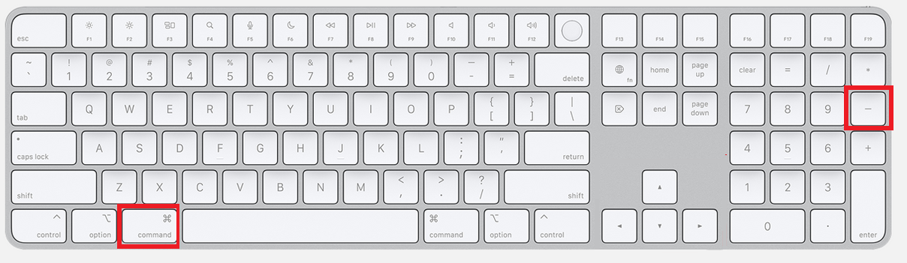

Rapidly deleting a row or column
[INSERT VIDEO HERE]

## Resizing Columns

### Resizing Using the Mouse
Double click on the border between columns or rows

### Resizing Using Hotkeys

Alt + h + o + i in sequence

PC Keyboards
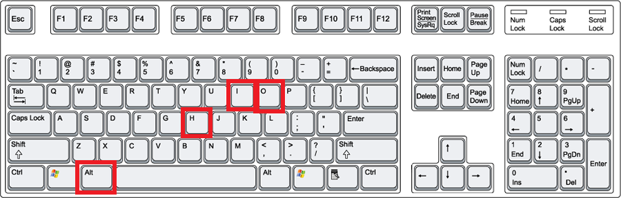

Mac keyboards
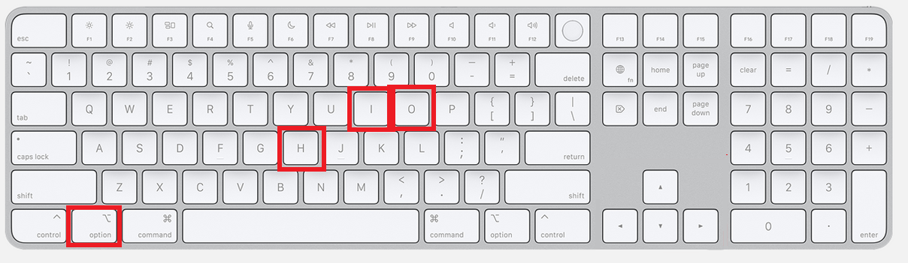

Resizing columns and rows
[INSERT VIDEO HERE]

## Removing Filters and Hiding and Unhiding Rows, Columns, and Cells

To quickly hide and unhide rows, columns, and cells use a combination of Ctrl + 9, Ctrl + Shift + (, Ctrl + 0, and Ctrl + Shift + ). This hotkey shortcut and the Select All shortcut of Ctrl + Shift + A are especially useful when used together to reveal all potentially hidden rows and columns in your worksheet.

PC Keyboards

Mac keyboards

