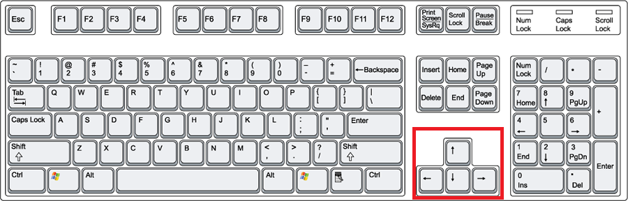
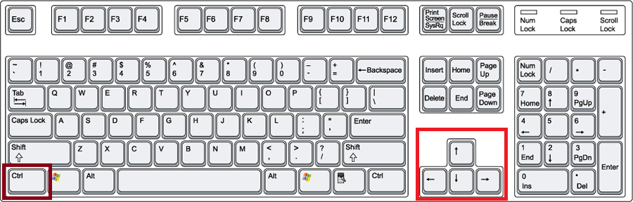
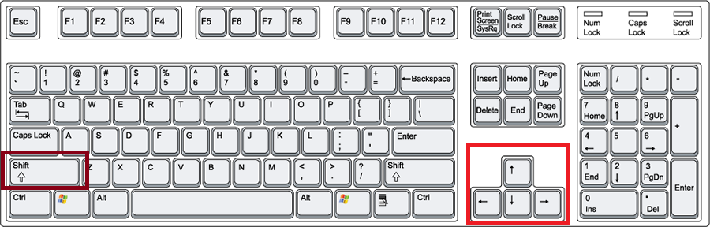
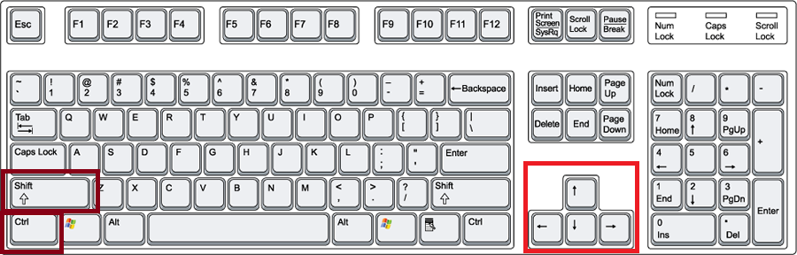
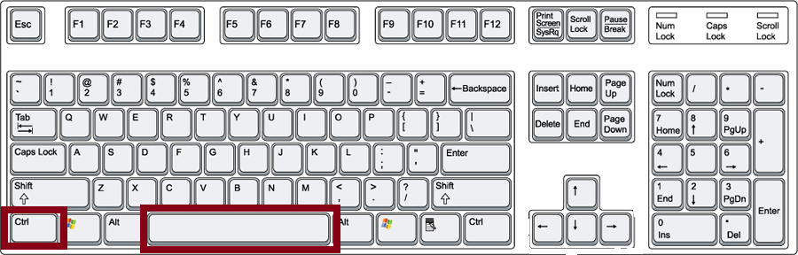
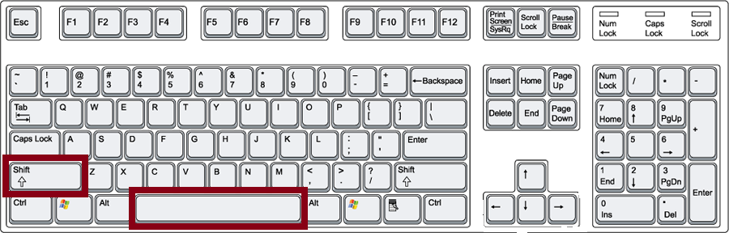
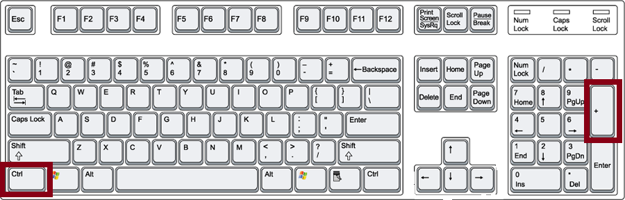

# Navigation

## Movement and Selection

### Simple Movement

These hotkeys will allow you to navigate between cells and sheets in your workbook without taking your hands off the keyboard 

Simple keyboard movements

Keyboard Combination | Key | Movement
------------ | ------------- | -------------
**->** | Right Arrow | Move one cell to the Right
**<-** | Left Arrow | Move one cell to the left
**↑**   | Up Arrow | Move one cell up
**↓**   | Down Arrow | Move one cell down

### Contiguous Movement

Contiguous movement is the movement of your curser between contiguous groups of cells, such as to the end of a row or end of a column. It is useful when you need to quickly jump to the end of a column or row of a large spreadsheet without having to scroll all the way through several thousand rows or mouse over several dozen columns.  To select the end of a contiguous row or column of data simple use Shift + Arrow keys

Keyboard Combination | Key | Movement
------------ | ------------- | -------------
**->** | Ctrl + Right Arrow | Move to the right most contiguous cell in the row
**<-** | Ctrl + Left Arrow | Move to the left most contiguous cell in the row
**↑**   | Ctrl + Up Arrow | Move to the top most contiguous cell in a column
**↓**   | Ctrl + Down Arrow | Move to the bottom most contiguous cell in a column

### Selecting Multiple Cells, Columns, or Rows

The combination of Shift + Arrow Key will allow you select multiple cells, columns, or rows.

Keyboard Combination | Key | Movement
------------ | ------------- | -------------
**->** | Shift + Right Arrow | Move to the right most contiguous cell in the row
**<-** | Shift + Left Arrow | Move to the left most contiguous cell in the row
**↑**   | Shift + Up Arrow | Move to the top most contiguous cell in a column
**↓**   | Shift + Down Arrow | Move to the bottom most contiguous cell in a column

### Rapidly Selecting Contiguous Cells
It is often helpful to rapidly select a contiguous row or column of cells in order to modify, delete, or move the data in that row or column. To quickly highlight and select a contiguous row or column you would hold down Shift + Ctrl and the appropriate arrow key

Keyboard Combination | Key | Movement
------------ | ------------- | -------------
**->** | Shift + Ctrl + Right Arrow | Move to the right most contiguous cell in the row
**<-** | Shift + Ctrl + Left Arrow | Move to the left most contiguous cell in the row
**↑**   | Shift + Ctrl + Up Arrow | Move to the top most contiguous cell in a column
**↓**   | Shift + Ctrl + Down Arrow | Move to the bottom most contiguous cell in a column

### Rapidly Selecting An Entire Row

To rapidly select an entire row in your spreadsheet use the hotkey combination of Shift + Spacebar

### Rapidly Selecting An Entire Column or Range

To rapidly select an entire column in your spreadsheet use the hotkey combination of Ctrl + Spacebar. Be careful that this hotkey selects an entire range of cells rather than just the individual column. Most of the time the "range" selected will only involve an individual column of cells. However, in certain cases this hotkey will select multiple contiguous columns within a given range.

### Adding a Row

To add a row of cells use your mouse or hotkey combination to select a row of cells and use the hotkey combination of Ctrl and the "+" key. Your new row of cells will be added above your current selection.

## Resizing Columns

### Resizing by Selecting
